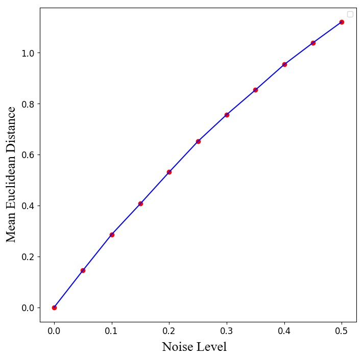

# Appendix

This appendix provides supplementary material for our submission, including theoretical proofs, additional experiments, and performance benchmarks.

---

## A. Performance on the Open Catalyst Dataset

We evaluate our method on the OC22 S2EF task, predicting total energy and per-atom forces. This benchmark involves 62,331 DFT relaxations over a range of oxide surfaces and adsorbates.

### Evaluation Metrics

* **Energy MAE ($\downarrow$)**: Mean Absolute Error in predicted energy.
* **Force MAE ($\downarrow$)**: MAE in predicted atomic forces.
* **Force Cosine Similarity ($\uparrow$)**: Mean cosine similarity between predicted and true force vectors.
* **EFwT ($\uparrow$)**: Percent of predictions where both energy and max force error are under thresholds.

### Results

Our method, when combined with the SIR-GN model, matches or exceeds the performance of physically informed neural networks (e.g., GemNet, DimeNet++) without requiring domain-specific constraints.

### Table: Results for the S2EF Task of the OC22 Dataset

Results for the S2EF task of the OC22 dataset comparing **C-CLT + SIRGN** with state-of-the-art physically informed neural networks. Values for SchNet, DimeNet++, and GemNet are from literature [OC22 Dataset].  
**↓** means lower is better; **↑** means higher is better. Best values are **bolded**.

| Model           | Energy MAE ↓ (ID) | Energy MAE ↓ (OOD) | Force MAE ↓ (ID) | Force MAE ↓ (OOD) | Force Cosine ↑ (ID) | Force Cosine ↑ (OOD) | EFwT ↑ (ID) | EFwT ↑ (OOD) |
|------------------|------------------|---------------------|------------------|---------------------|----------------------|-----------------------|-------------|--------------|
| SchNet           | 7.9240           | 7.9250              | 0.0600           | 0.0820              | 0.3630               | 0.2200                | 0.00%       | 0.00%        |
| DimeNet++        | 2.0950           | 2.4750              | 0.0430           | 0.0590              | 0.6060               | 0.4360                | 0.00%       | 0.00%        |
| GemNet           | 0.3740           | **0.8290**          | 0.0290           | **0.0400**          | 0.6910               | 0.5500                | **0.02%**   | 0.00%        |
| C-CLT + SIRGN    | **0.3705**       | 0.8585              | **0.0275**       | 0.0410              | **0.6996**           | **0.5701**            | 0.01%       | 0.00%        |

---

## B. Perturbation Tests

### Robustness to Noise in Rotation-Translation Invariant Transformation

**Figure:** The plot shows the mean Euclidean distance between the canonical locations of a perturbed graph and its unperturbed counterpart. Perturbations apply random rotations and translations, scaled by γ ∈ (0, 0.5) with increments of 0.05.

To evaluate the robustness of our proposed **C-CLT** method and confirm its invariance to rotation and translation, the above plot shows the mean Euclidean distance between the canonical locations of a perturbed graph $\tilde{G}$ and its unperturbed version $G$.

The perturbation involves applying random rotations and translations, controlled by a scaling factor γ ranging from 0 to 0.5 in steps of 0.05. When γ = 0, the distance is zero, verifying full invariance. As γ increases, the average distance grows approximately linearly, reflecting how the method consistently maintains geometric coherence even under increasingly aggressive transformations.

These results validate that our approach is robust to spatial noise and preserves structure under rotation and translation.
